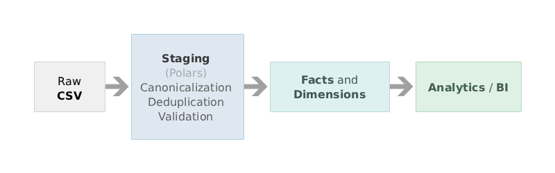

# VGDB Analytics Pipeline

#### End-to-end data pipeline transforming raw video game metadata into analytics-ready facts & dimensions.

This project takes a video game dataset and builds a clean, cloud-ready analytics warehouse using modern Python tooling and data engineering best practices.

The pipeline ingests raw CSV data from a video game database (VGDB), performs staging-level cleanup and canonicalization, builds dimensional models, and produces a fact table suitable for BI, analytics, and downstream machine-learning workloads.



### Dataset

The project uses a [public video game dataset](https://www.kaggle.com/datasets/jummyegg/rawg-game-dataset) containing:

- ~665k raw game identity records
- ~474k game metadata records
- Platform information stored as delimited strings
- Missing values and duplicate identifiers
- Heterogeneous categorical fields (platforms, genres, developers)

The datasets are excluded from this repository, but you can download them and place them in the `data/warehouse/vgdb` directory. Here's the structure of the additional directory that is missing in this repository:

```
	root
	\data
		\processed          -- Contains .parquet files
			\analytics
				\models
			\staging
		\warehouse
			\vgdb           -- Contains raw .csv datasets
```

### Goals

The main purpose of this project is to learn everything related to data engineering and analytics by using raw real-world data and making it production-ready. The learning steps are documented in the `docs/overview.txt` file, including project's structure, tools used and basic definitions.